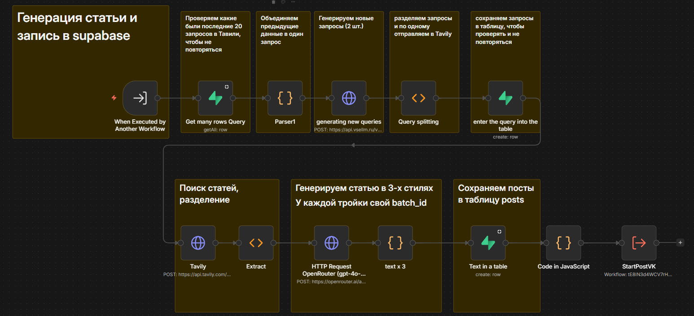
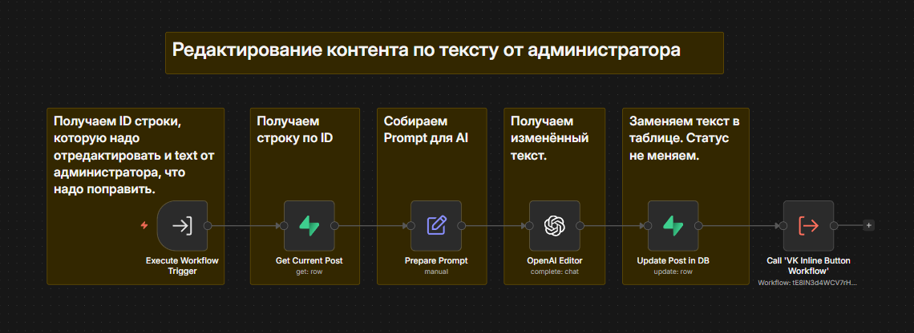
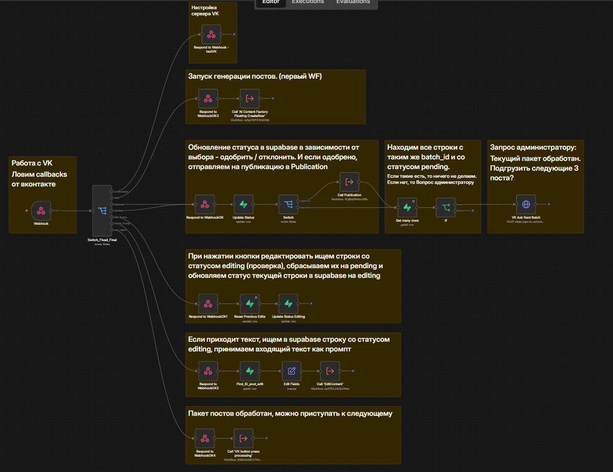
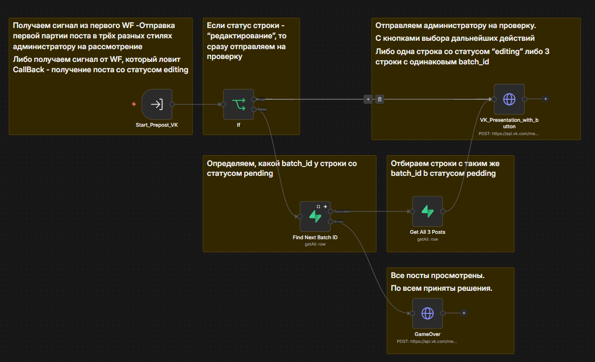
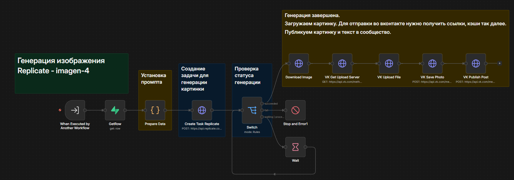

# 🤖 Autonomous AI Content Factory via n8n & Supabase

[Читать на русском языке](README.ru.md)

A production-ready content marketing automation system featuring Multi-Agent AI system integration and a Human-in-the-loop moderation flow.

The system autonomously researches trends, generates unique text and graphic content, manages publication stages via a database backend, and handles real-time user edits directly from a messenger interface.

---

## 🛠 Tech Stack
* **Workflow Orchestration:** n8n (Advanced Workflow Automation)
* **Backend & Database:** Supabase / PostgreSQL (State & Content Management)
* **Language Models (LLMs):** GPT-4o-mini / Gemini (via OpenRouter API)
* **Image Generation:** Replicate API (Imagen-3 / Flux models)
* **Information Retrieval:** Tavily API (Real-time AI Web Search)
* **Interfaces & APIs:** VK API, Webhooks, Callbacks

---

## 📐 Project Architecture (Modular System)

The project is designed using a modular approach and split into 6 interconnected workflows (microservices) that communicate via Webhooks, internal n8n functions (Execute Workflow), and a centralized Supabase database:

1. **[01_CreateRow.json](workflows/01_CreateRow.json)** — Initialization Module. Creates a new record in the Supabase database, triggers AI content generation, and prepares primary data structures.

  
🔍 View workflow schema

   
  

2. **[02_Edit Content.json](workflows/02_Edit%20Content.json)** — AI Editing Module. Handles content adjustment requests from the user, executes local text rewriting via LLM, and updates the database records.

  
🔍 View workflow schema

   
  

3. **[03_Callbacks.json](workflows/03_Callbacks.json)** — Callback Webhook Handler. Intercepts incoming signals from interactive moderation buttons and routes processes based on the administrator's decision.

  
🔍 View workflow schema

   
  

4. **[04_VK button press processing.json](workflows/04_VK%20button%20press%20processing.json)** — VK API Interactive Loop. Manages sending generated content to the human moderation interface with inline control buttons and processes clicks within the VK UI.

  
🔍 View workflow schema

   
  

5. **[05_Publication.json](workflows/05_Publication.json)** — Content Distribution Module. Automatically triggers when a post status changes to final, publishing the completed content package (text + media files) to the target platform.

  
🔍 View workflow schema

   
  

6. **[06_Error Handler WF.json](workflows/06_Error%20Handler%20WF.json)** — System Error Catching Workflow. A dedicated service pipeline for logging API failures, sending real-time alerts to the developer via VK, and preventing hanging database transactions.

---

## 📊 Database Schema (Supabase)
The system utilizes a relational structure to enforce state management and tracking:
* `posts` — Stores generated text, media asset URLs, `batch_id`, and current lifecycle statuses (`pending`, `approved`, `editing`).
* `history_topics` — Logs previously used topics to prevent duplicate content generation.

---

## 🚀 How to Setup Locally
1. Install and launch an **n8n** instance (locally or cloud-hosted).
2. Create a new database project in **Supabase**.
3. Open the SQL Editor in your Supabase dashboard and execute the database initialization script from the **[supabase/migrations.sql](supabase/migrations.sql)** file.
4. Import the required `.json` workflow files from the `workflows/` directory of this repository into your n8n environment.
5. Configure system environment variables and connection Credentials for OpenRouter, Replicate, Tavily, and VK API.